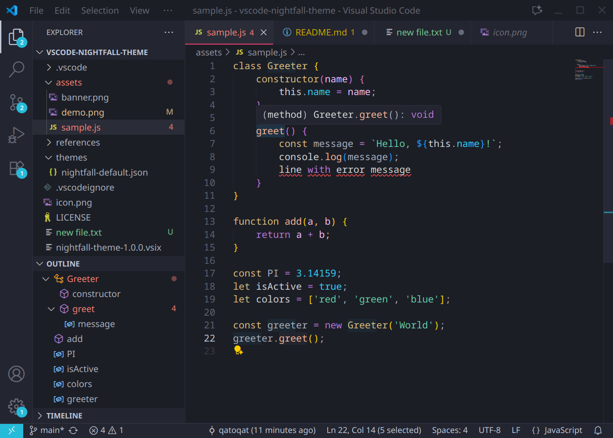

# Nightfall Theme for VS Code

A dark, clean, simple and elegant VSCode theme, based on the original [JetBrains Nightfall Theme](https://github.com/coeiico/jetbrains-nightfall-theme)

# Demo

# Contributions

This theme currently covers most commonly used components. If something is missing, you can report an [issue](https://github.com/qatoqat/vscode-nightfall-theme/issues) or [contribute](https://github.com/qatoqat/vscode-nightfall-theme/pulls)

# License

MIT

# Credits

Original author and maintainers:  

https://github.com/coeiico/jetbrains-nightfall-theme

# Donate

If you like my work, support me on Ko-Fi!  

